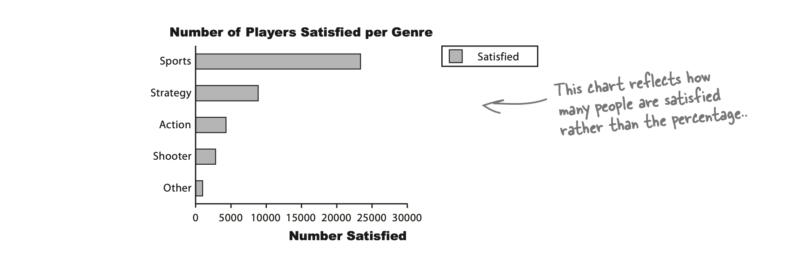

# Bar charts can allow for more accuracy(막대 차트를 사용하면 정확도를 높일 수 있다.)
```
A better way of showing this kind of data is with a bar chart.
막대 차트를 이용해 이런 종류의 데이터를 보여주는 것이 더 좋다.

Just like pie charts, bar charts allow you to compare relative size,
파이 차트와 마찬가지로 막대 차트도 상대적인 크기를 비교할 수 있다.

but the advantage of using a bar chart is that they allow for a greater degree of precision(정밀도).
하지만 막대차트를 사용했을 때의 이점은 보다 정밀하게 표현할 수 있다.

They're ideal(이상적인) in situations where categories are roughly(대략, 거의) the same size, 
카테고리들이 거의 같은 크기인 상황에서 이상적이다.

as you can tell with far greater precision which category has the highest frequency.
어떤 카테고리의 빈도가 가장 높은지 훨씬 더 정확하게 알 수 있다.

It makes it easier for you to see small diffreences.
그것은 당신이 작은 차이를 더 쉽게 볼수 있도록 한다.
```

```
On a bar chart, each bar represents a particular(특정) category,
막대 차트에서는, 각 막대는 특정 카테고리를 나타내고

and the length of the bar indicates the value.
막대의 길이는 값을 나타낸다.

The longer the bar, the greater the value.
가장 긴 막대가, 가장 큰 값이다.

All the bars have the same width,
모든 막대바는 똑같은 넓이를 가진다.

which makes it easier to compare them
그래서 그것들을 비교하는게 더 쉽다.
```

```
Bar charts can be drawn either vertically or horizontally.
막대 차트는 세로 또는 가로로 그릴 수 있다.
```

# Vertical bar charts(세로 막대 차트)
```
Vertical bar charts show categories on the horizontal axis,
세로 막대 차트에서는 가로 축이 카테고리이고,

and either frequency or percentage on the vertical axis.
빈도수나 퍼센트는 세로 축이다.

The height of each bar indicates the value of its category.
각 막대의 높이는 해당 카테고리의 값을 나타낸다.

Here's an example showing the sales figures in units for five regions, A, B, C, D, and E.
다음은 A, B, C, D, E 각 5개의 리전의 판매 수치를 단위로 표현한 예다.
```


# Horizontal bar charts
```
Horizontal bar charts are just like vertical bar charts except that the axes are flipped round.
가로 막대 차트는 축이 뒤집혔다는 점만 제외하면 세로 막대 차트와 비슷하다.

With horizontal bar charts, you show the categories on the vertical axis and the frequency or percentage on the horizontal axis.
가로형 막대 차트는 카테고리가 세로 축이고, 가로축이 빈도수 도는 퍼센트이다.
```

```
Here's a horizontal bar chart for the CEO's genre data from page 9.
다음은 9페이지에 있는 CEO의 장르 데이터를 이용한 가로 막대 차트이다.

As you can see, it's much easier to quickly gauge which category has the highest value, and which the lowest.
보시면, 어떤 카테고리가 가장 높고 낮은지 빠르게 볼 수 있다.
```


```
Vertical bar charts tend(경향) to be more common,
세로 막대 차트가 더 일반적인 경향이 있다.

but horizontal bar charts are useful if the names of your categories are long.
하지만 카테고리 이름이 길면 가로 막대 차트도 유용하다.

They give you lots of space for showing the name of each category without having to turn the bar labels sideways.
라벨을 옆으로 돌릴 필요 없이 각 카테고리의 이름을 적을 공간이 충분하다.
```

```
The vertical bar chart shows frequency, and the horizontal bar chart shows percentages.
세로 막대 차트는 빈도수를 보여주고 가로 막대 차트는 비율을 보여준다.

When should I use frequencies and when should I use percentages?
빈도수는 언제 사용해야하고 비율은 또 언제 사용해야하나?
```

## It depends on what message you want to convey(그것은 당신이 어떤 메시지를 전달할 것인지에 달려있다.)
```
Let's take a closer look.
자세히 살펴보자.
```

# It's a matter of scale(스케일 문제)
```
Understanding scale allows you to create powerful bar charts that pick out the key facts you want to draw attention(주목) to.
스케일에 대한 이해는 주목하고 싶은 중요한 사실을 골라내는 강력한 막대 차트를 만들 수 있게 한다.

But be careful,
하지만 조심해야할게

scale can also conceal(감추다) vital(중요한) facts about your data.
스케일은 데이터에서 중요한 사실을 감추기도 한다.

Let's see how.
어케 하는지 보시죠.
```

## Using percentage scales(백분율 스케일을 사용)
```
Let's start by taking a deeper look at the bar charts showing player satisfaciton per game genre.
막대 차트가 보여주는 게임 장르별 플레이어 만족도를 자세히 살펴보시죠.

The horizontal axis shows player satisfaction as a percentage,
가로 축은 플레이어 만족도를 백분율로 보여준다.

the number of people out of every hundred who are satisfied with this genre.
숫자는 100명중 해당 장르에 만족한 사람의 수이다.
```


```
The purpose of this chart is to allow us to compare different percentages
이 차트의 목적은 백분율의 차이를 비교하고

and also read off percentages from the chart
차트로부터 백분율을 읽을 수 있다.
```

```
There's just one problem
여기 한가지 문제가 있다

it doesn't tell us how many players here are for each gener.
얼마나 많은 플레이어들이 각 장르에 있는지 보여주지 않는다.

This may not sound important.
중요하지 않게 들릴 수 있다.

but it means taht we have no idea whether this reflects the views of all players, some of them, or even just a handful.
하지만 이것은 모든 플레이어의 의견인지 일부 플레이어의 의견인지 아니면 소수 플레이어의 의견인지 알 수 없는 것을 의미한다.

In other words, we don't know how representative(대표) this is of players as a whole.
다시 말해, 전체 플레이어를 얼마나 대표하는지 알 수 없다.

The golden rule for designing charts that show percentages is to try and indicate the frequencies, either on the chart or just next to it.
그래서 백분율 차트를 그릴때 가장 중요한 규칙은 차트나 바로 옆에 빈도수도 나타내라.
```

## Be very wary(경고, 주의) if you're given percentages with no frequencies, or a frequency with no percentage(백분율을 표시할 때 빈도수를 표시하지 않거나 빈도수를 표시할 때 백분율을 표시하지 않을 때 조심해라.)
```
Sometimes this is a tactic(전술) used to hide key facts about the underlying data, as just based on a chart, you have no way of telling how representative it is of the data.
차트만으로는 데이터의 대표성을 알 수 없기 때문에 기초 데이터의 주요 사실을 숨기는 데 사용되는 전술(전술)이기도 합니다.

You may find that a large percentage of people prefer one particular game genre, but that only 10 people were questioned.
많은 사람들이 특정 게임 장르를 선호한다는 사실을 알 수 있지만, 설문조사에 참여한 사람은 10명에 불과했습니다.

Alternatively, you might find that 10,000 players like sports games most, 
또는 10,000명의 플레이어가 스포츠 게임을 가장 좋아한다는 사실을 발견할 수도 있지만, 

but by itself, you can’t tell whether this is a high or low proportion of all game players.
이 수치만으로는 전체 게임 플레이어 중 높은 비율인지 낮은 비율인지 알 수 없습니다.
```

# Using frequency scales(빈도수 스케일 사용)
```
You can show frequencies on your scale instead of percentages.
백분율 대신 빈도수를 스케일로 표현할 수 있다.

This makes it easy for people to see exactly what the frequencies are and compare values.
그것은 빈도수를 정확하게 보는 것을 쉽게 하고 값들의 비교를 쉽게 만든다.
```




```
Normally your scale should start at 0, but watch out!
일반적으로 스케일은 0에서 시작해야한다. 하지만 조심하셈!

Not every chart does this
모든 차트들이 그런것은 아니다.

and as you saw earlier on page 6, 
6페이지에서 본것 처럼

using a scale that doesn't start at 0 can give a different first impression of your data.
0에서 시작하지 않는 스케일을 사용하면 데이터에서 첫인상을 다르게 줄 수 있다.

This is something to watch out for on other people's charts, 
다른 사람의 차트에서 주의해야할 사항이다.

as it's very easy to miss
놓치기 쉽기 때문에

and can give you the wrong impression of the data
데이터의 잘못된 첫인상을 줄 수 있다.
```

```
So are you telling me that I have to choose between showing frequency or percentages?
그럼 빈도와 백분율 중에 선택해야 한다는 말임?

What if I want both?
둘다 원하면 어떡함?
```

## There are ways of drawing bar charts that give you more flexibility.(막대 차트를 좀 더 유연하게 그리는 방법이 있음)
```
The problem with these bar charts is that show either the number of satisfied players or the percentage,
막대 차트의 문제는 만족한 플레이어의 수 또는 백분율 중에 하나를 보여줌

and they only show satisfied players.
그리고 오직 만족한 플레이어만 보여줌
```

```
Let's take a look at how we can get around this problem.
우리가 이 문제 어케 해결할 수 있는지 함 봅시다.
```

# Dealing with multiple sets of data(여러 집합의 데이터 다루기)
```
With bar charts, it's actually really easy to show more that one set of data on the same chart.
막대 차트에서는 같은 차트위에 더 많은 데이타 집합을 보여주는것은 사실 개쉬움.

As an example, 
예로,

we can show both the percentage of satisfied players and the perccentage of dissatisfied players on the same chart.
만족한 플레이어의 퍼센테이지랑 불만족한 플레이어의 퍼센테이지를 같은 차트에 그린거임.
```


## The split-category bar chart(카테고리가 분리된 막대 차트)
```
One way of tackling this is to use one bar for the frequency of satisfied players
이 문제를 해결할 방법은 막대 하나는 만족한 플레이어의 빈도를 나타내고

and another for those dissatisfied,
다른 하나는 불만족한 플레이어를 나타내면 됨

for each genre.
각 장르에 대해

This sort of chart is useful
이러한 차트의 정렬은 유용함

if you want to compare frequencies.
빈도를 비교하는데 있어서

but it's difficult to see proportions and percentages.
하지만 비율과 백분율을 보기에는 어려움
```

## The segmented bar chart(분할된 막대 차트)
```
If you want to show frequencies and percentages,
빈도랑 퍼센트 둘다 보여주고 싶으면

you can try using segmented bar chart.
분할된 막대 차트 써보셈

For this, you use one bar for each category.
각 카테고리 마다 막대 하나만 쓰면 됨

but you split the bar proportionally.
대신 막대의 비율을 분리해야 됨

The overall length of the bar reflects the total frequency.
막대의 길이는 전체 빈도수를 나타냄
```


```
This sort of chart allows you to quickly see the total frequency of each category and the frequency of player satisfaction.
이런 차트의 정렬은 각 카테고리의 전체 빈도와 플레이어 만족도의 전체 빈도 빠르게 볼 수 있게 함.

in this case, the total number of players for each genre
위 예에서는 각 장르에 대한 전체 플레이어의 수임

You can see proportions a a glance, too.
또 비율도 한눈에 볼 수 있음
```

# Your bar charts rock(막대 차트가 흔들림)
```
The CEO is thrilled with the bar charts you've produced, 
당신이 만든 막대 차트에 CEO가 지렸음

but there's more data he needs to present at the keynote
하지만 기조연설에서 발표해야할 데이터가 더 남았음
```

```
Nice work!
잘했으!

Those charts are going to be a big hit at the expo.
이 차트들 엑스포에서 대박 날듯!

I've got another assignment for you.
과제 하나 더 줄게

We've been testing a new game with a group of volunteers,
자원 봉사자들 그룹과 함께 새로운 게임을 테스트 해왔음

and we need a chart the show the breakdown of scores per game.
그리고 게임별로 점수 분석을 보여줄 차트가 필요해

Here's the data.
여기 데이터
```


```
This data looks different from the other types of data we've seen so far.
이 데이터는 우리가 봐온 데이터들과 다르게 보이네.

I wonder if that means we treat it differently?
그럼 우리가 다르게 다뤄야 한다는 건가?
```

# Categories(카테고리) vs. numbers(숫자).
```
When you're working with charts,
차트로 작업할 때

one of the key things you need to figure out is what sort of data you're dealing with.
파악해야할 중요한 핵심은 어떤 종류의 데이터를 다루고 있는지임.

Once you've figured that out,
이를 파악한 후에는

you'll find it easier to make key decisions about what chart you need to best represent your data
당신의 데이터를 제일 잘 표현할 수 있데 필요한 차트를 더 쉽게 고를 수 있음
```

## Categorical(범주적) or qualitative(질적인) data
```
Most of the data we've seen so far is categorical.
우리가 봐온 대부분의 데이터가 범주적임

The data is split into categories that describe qualities or characteristics.
데이터는 품질 또는 특성을 설명하는 카테고리로 나뉨

For this reason, it's also called qualitative data.
그래서 질적인 데이터라고도 불림

An example of qualitative data is game genre;
질적인 데이터의 예로는 게임 장르가 있음

each genre forms a separate category.
각 게임 장르는 별도의 카테고리를 형성함
```

```
The key thing to remember with qualitative data is that the data values can't be interpreted as numbers.
질적인 데이터에 대해 기억해야할 핵심은 해당 데이터 값을 숫자로 해석될 수 없다는 것.
```

## Numerical(수치) or quantitative(정량적) data
```
Numerical data, on the other hand, deals with numbers.
반면 숫자 데이터는 숫자를 다룸.

It's data where the values have meaning as numbers,
값이 숫자로서 의미를 가짐

and that involves measurements or counts.
여기에는 측정 또는 카운트가 포함됨

Numerical data is also called quantitative data.
숫자형 데이터는 정량적 데이터라고도 불림

because it describes quantities.
왜나면 수량을 설명하기 때문
```

```
So what impact does this have on the chart for Manic Mango?
그렇다면 이것이 마닉 망고 차트에 어떤 영향을 미침?
```

# Dealing with grouped data
```
The latest set of data from the Manic-Mango CEO is numeric and,
마닉 망고 CEO의 최신 데이터 셋은 숫자형임


what's more, the score are grouped into intervals.
뿐만 아니라, 일정 간격으로 점수들이 그룹화 됨

So what's the best way of charting data like this?
그러면 이런 데이터를 차트화 하는 가장 좋은 방법은 뭘까?
```


```
That's easy, don't we just use a bar chart like we did before?
쉽네, 이전처럼 막대 차트 쓰면 안됨?

We can treat each group as a separate category.
각 그룹을 분리된 카테고리로 쓰면 됨
```

## We could, but there's a better way.(할 수는 있음, 근데 더 좋은 방법이 있음)
```
Rather than treat each range of scores as a separate category
각 점수 범위를 별도의 카테고리로 취급하는 대신

we can take advantage of the data being numeric,
데이터가 숫자라는 점을 활용하여,

and present the data using a continuous numeric scale instead.
연속적인 숫자 스케일을 사용하여 데이터를 표현할 수 있다

This means that instead of using bars to represent a single item,
막대를 하나의 아이템을 표현하는 것 대신에

we can use each bar to represent a range of score
각 막대를 점수의 범위를 표시하는데 사용할 수 있다
```

```
To do this, we can create a histogram.
이를 위해 히스토그램을 만들 수 있다.
```

```
Histograms are like bar charts but with two key differences.
히스토그램은 막대 차트랑 비슷한데 다른 점이 2개 있음

The first is that the area of each bar is proportional to the frequency,
첫번째는 각 막대의 면적이 빈도수에 비례함

and the second is that there are no gaps between the bars on the chart.
두번째는 차트 위에 막대들 사이에 간격이 없다는 것

Here's an example of a histogram showing the average number of games bought per month by households in Statsville
다음은 Statsville의 가구가 한 달에 구매한 평균 게임 수를 보여주는 히스토그램의 예.
```


# To make a histogram,start by finding bar withds(히스토그램을 만드려면, 막대의 넓이를 먼저 구해야 함)
```
The first step to creating a histogram is to look at each of the intervals
히스토그램을 만드는 첫번째 단계는 각 간격을 살펴보는 것

and work out how wide each of them needs to be
다음 각각 어느정도의 넓이가 필요한지 계산

and what range of values each one needs to cover.
그리고 각 값의 범위는 어느 정도여야 하는지 계산

While doing this, we need to make sure that there will be no gaps between the bars on the histogram.
이걸 하면서 히스토그램의 막대들 사이에 간격이 없는지 확인 해야됨
```

```
Let's start with the first two intervals, 0-199 and 200-399.
자 0-199랑 200-399 두 간격 부터 시작해 보자

At face value, the first interval finishes at score 199
적혀있는 대로 첫번째 간격은 199로 끝남

and the second starts at score 200.
그리고 두번째 점수는 200 부터 시작함

The problem with plotting it like this
문제는 이렇게 표시할 경우

however, is that it would leave a gap between score 199 and 200, like this
다음과 같이 점수 199와 200 사이에 간격이 생김
```


```
Histogram shouldn't have gaps between the bars,
히스토그램은 막대 사이에 간격이 있으면 안됨

so to get around this
그래서 문제를 해결하려면

we extend their ranges slightly.
막대를 약간 넓히면 됨

Instead of one interval ending at score 199 and the next starting at score 200,
첫번째 점수를 199로 끝내고 두번째 점수를 200으로 시작하는 것 대신에


we make the two intervals meet at 199.5 like this:
다음 처럼 두 간격을 199.5에서 만나게 만들면 됨.
```


```
Doing this forms a single boundary and make sure that there are no gaps between the bars on the histogram.
이렇게 하면 하나의 경계로 만들 수 있고 히스토그램의 막대들 사이에 간격을 없앨 수 있음

If we complete this for the rest of the intervals, we get the following boundaries:
나머지 간격에 대해 위를 완료하면 아래와 같은 경계를 얻을 수 있음
```


```
Each interval covers 200 scores, and the width of each interval is 200.
각 인터벌은 200점을 커버하고, 각 인터벌의 넓이도 200임

Each interval has the same width.
각 인터벌은 같은 넓이를 가짐
```

```
As all the intervals have the same with,
모든 인터벌이 같은 넓이를 가졌기 때문에, 

we create the histogram by drawing vertical bars for each range of scores,
점수의 각 범위에 대해 세로 막대를 히스토그램에 그릴 수 있음

using the boundaries to form the start and end point of each bar.
경계를 사용해서 각 막대의 시작점과 끝점을 형성함

The height of each bar is equal to the frequency.
각 막대의 높이는 빈도수와 동일
```

# There are no Dumb Questions(멍청한 질문은 없다)
```
Q: So is a histogram basically for grouped numeric data?
Q: 히스토그램은 기본적으로 그룹화된 숫자형 데이터인가요?

A: Yes it is. The advantage of a histogram is that because its numeric, you can use it to show the width of each interval as well as the frequency
A: 맞음. 히스토그램의 장점은 그것이 숫자로 되어있단거임. 이걸 사용해서 각 인터벌의 폭과 빈도수를 보여줄 수 있음
```

```
Q: What about if the intervals are different widths? Can you still use a histogram?
Q: 인터벌 간격이 다르면 어떡함? 그래도 히스토그램 사용 가능?

A: Absolutely. It's more common for the interval widths to be equal size, 
물론. 간격 너비는 같은 사이즈로 하는게 일반적임

but with a histogram they don't have to be.
근데 히스토그램은 그럴 필요는 없음

There are a couple more steps you need to go through to create a histogram with unequal sized intervals,
간격이 다른 히스토그램을 만들려면 몇단계를 더 거쳐야 됨

but we'll show you that very soon.
조만간 보여줄게
```

```
Q: Why shouldn't histogram have gaps between the bars?
Q: 왜 히스토그램은 막대 사이에 간격이 있으면 안됨?

A: There are at least two good reason.
그렇게하면 최소 두가지 좋은점이 있음

The first is to show that there are no gaps in the values,
첫번째는 값 사이에 간격이 없다는 것을 보여줌

and that every value is covered.
그리고 모든 값이 커버됨

The second is so that the width of the interval reflects the range of the values you're covering.
두 번째는 인터벌의 폭이 커버하는 값의 범위를 나타내도록 함.

As an example, if we drew the interval 0-199 as extending from value 0 to value 199,
예로, 0-199 인터벌을 0에서 199까지 연장하는 것을 보고 그렸다 가정

the width on the chart would only be 199 - 0 = 199.
차트의 폭은 199 - 0 = 199가 됨
```

```
Q: So why do we make the bars meet midway between the two?
Q: 그래서 왜 막대를 두개 중간에서 만나게 만들어야 됨?

A: The bars have to meet, and it's usually at the midway point,
A: 막대는 만야됨, 그리고 일반적으로 중간 지점에서 만남

but it all comes down to how you round your values.
하지만 모든 것은 값을 반올림하는 방법에 달려 있음.

When you round values, you normally round them to the nearest whole number.
반올림 할때 일반적으로 정수에서 가장 가까운 숫자로 반올림 함

This means that the range of values from -0.5 to 0.5 all round to 0,
값의 범위가 -0.5에서 0.5 사이면 전부 0으로 반올림 되는 것을 뜻함

and so when we show 0 on a histogram
그래서 히스토그램에 0으로 표시할 때,

we show it using the range of values from -0.5 to 0.5
값의 범위를 -0.5에서 0.5까지 사용하여 표시.
```

```
Q: Are there any exceptions to this?
Q: 또 다른 예외사항이 있나요?

A:Yes, age is one exception.
A: 물론. 나이가 하나의 예외임.

If you have to represent the age range 18-19 on a histogram,
히스토그램에 18-19 범위의 나이를 표현한다면

you would normally represent this using an interval that goes from 18 to 20.
일반적으로 18부터 20 사이의 인터벌 사용하여 이를 표시한다.

The reason for this is that we typically classify someone as being 19, for example, up until thier 20t birthday.
그 이유는 일반적으로 예로, 20번째 생일이 되기 전까지는 19세로 분류하기 때문

In effect, we round ages down.
사실상 나이를 반올림 함.
```

# BULLET POINTS
```
The frequency is a statistical way for saying how many items there are in a category.
프리퀀시는 카테고리에 얼마나 많은 항목이 있는지 보여줄 수 있는 통계적으로 나타내는 방법이다.
```

```
Pic charts are good for showing basic proportions.
파이 차트는 기본적인 비율을 보여주기 좋다.
```

```
Bar charts give you more flexibility and precision.
막대 차트는 더욱 유연하고 정밀함을 준다.
```

```
Numerical data deals with numbers and quantities
숫자형 데이터는 숫자와 수량을 다룸

categorical data deals with words and qualities.
범주형 데이터는 단어와 품질을 다룸
```

```
Horizontal bar charts are used for categoricla data.
가로형 막대 차트는 범주형 데이터에 사용
```

```
Vertical bar charts are used for numerical data,
세로형 막대 차트는 숫자형 데이터에 사용

or categorical data if the category names are short
또는 카테고리 이름이 짧은 범주형 데이터에서 사용
```

```
You can show multiple sets of data on a bar chart
여러 집합의 데이터를 막대 차트에 표현할 수 있음

and you have a choice of how to do this.
그리고 어떻게 하는지 알고 있다

You can compare frequencies by showing related bars side-by-side on a split-category bar chart
분리된 카테고리 막대 차트에 관련된 막대를 나란히 배치하여 빈도를 비교할 수 있음.

You can show proportions and total frequencies by stacking the bars on top of each other on a segmented bar chart.
비율과 총 빈도를 구분된 막대 차트에 각 막대 위에 쌓아서 보여줄 수 있음
```

```
Bar chart scales can show either percentages or frequencies.
막대 차트 스케일은 백분율 또는 빈도를 보여줄 수 있음
```

```
Each chart comes in a number of different varieties.
각 차트는 여러 가지 종류가 있음.
```

# Manic Mango needs another chart(마닉 망고는 다른 차트를 필요로 함)
```
The CEO is very pleased with the histogram you've created for him
CEO는 만든 히스토그램에 매우 만족함.

so much so, that he wants you to create another histogram for him.
다른 히스토그램을 만들어 달라고 요청할 정도임.

This time, he wants a chart showing for how long Manic Mango players tend to play online games over a 24-hour period.
이번에는 망고 플레이어가 24시간 동안 온라인 게임을 얼마나 오래 플레이하는지를 보여주는 차트를 만들고자 함

Here's the data
아래는 데이터
```


```
There's something funny about that data.
재밌는 데이터가 있네

It's grouped like last time,
저번처럼 그룹화 되었네

but the intervals aren't all the same witdh
근데 인터벌이 전부 다르네
```

## He's right, the interval widths aren't all equal(남자 말이 맞음, 인터벌 폭이 다 다름)
```
If you take a look at the intervals,
인터벌들을 봤다면

you can see that they're different widths.
전부 다를 폭을 가진것을 볼 수 있음

As an example, the 10-24 range covers far more hours than 0-1 range.
예로, 10-24 범위는 0-1 범위보다 훨씬 더 많은 시간을 커버함.
```

```
If we had access to the raw data, we could look at how we could construct equal width intervals,
만약 로우 데이터가 있으면 인터벌을 같은 넓이로 만드는 방법을 찾아 볼텐데

but unfortunately this is all the data we have.
하지만 불행하게도 이게 우리가 가진 데이터의 전부야.

We need a way of drawing a histogram that makes allowances for the data having different widths.
다른 넓이를 가진 데이터를 허용하는 히스토그램으로 그릴 방법이 필요함
```

### BRAIN POWER
```
For histograms, the frequency is proportional to the area of each bar.
히스토그램에서, 빈도는 각 막대의 영역에 비례한다

How would you use this to create a histogram for this data?
이 데이터로 히스토그램을 그리려면 어떻게 사용해야 할까?

What do you need to be aware of?
무엇을 주의해야 하나?
```

```
I think we can just create this in the same way we did before - it's no big deal
그냥 전에 했던것 처럼 같은 방법으로 만들면 될것 같은데. 별거 아닌듯

We draw bars on a numeric scale;
숫자형 스케일로 막대 그리면 됨

it's just that this time the bars are different widths.
이번에는 막대의 넓이가 다를 뿐임
```

## Do you think she's right?(그녀 말이 맞다고 생각하나요?)
```
Here's sketch of the chart,
아래는 그려진 차트임

using frequency on the vertical scale and drawing bar widths proportional to their interval size.
빈도는 가로 스케일에 사용했고 인터벌 사이즈에 비례해서 막대의 넓이를 그렸음

Do you see any problems?
문제가 안보이나요?
```


## A histogram's bar area must be proportional to frequency.(히스토그램의 막대 넓이는 빈도에 반드시 비례해야 함)
```
The problem with this chart is that making the width of each bar reflect the width of each interval has made some of the bars look disproportionately large.
이 차트의 문제점은 각 막대의 너비가 각 인터벌의 너비를 반영하도록 만들면 일부 막대가 불균형적으로 크게 보인다는 것.

Just glancing at the chart,
차트를 얼핏 보면

you might be left width a misleading impression about how many hours per day people really play games for.
사람들이 실제로 하루에 몇 시간 동안 게임을 하는지에 대한 오해의 소지가 있을 수 있다.

As an example, the bar that takes up the largest area is the bar showing game play of 10-24 hours even though most people don't play for this long.
예를 들어, 대부분의 사람들이 이렇게 오래 플레이하지 않음에도 가장 큰 면적을 차지하는 막대는 10~24시간의 게임 플레이를 보여주는 막대임.
```

```
As this is a histogram, we need to make the bar area proportional to the frequency it represents.
히스토그램이므로 막대 영역이 나타내는 빈도에 비례하도록 만들어야 합니다.

As the bars have unequal widths,
막대의 너비가 같지 않기 때문에,

what should we do to the bar height?
막대 높이를 어떻게 함?
```

# Make the area of histogram bars proportional to frequency(히스토그램 막대의 면적을 빈도에 비례하도록 만들기)
```
Up until now, we've been able to use the height of each bar to represent the frequency of a particular number or category.
지금까지, 각 막대의 높이를 빈도나, 특정 숫자나 카테고리를 나타내는데 사용해 왔음
```

```
This time around, we're dealing with grouped numeric data where the interval widths are unequal.
이번에는, 간격 폭이 같지 않은 그룹화된 숫자 데이터를 다루고 있음.

We can make the width of each bar reflect the width of each interval,
각 막대의 넓이는 각 인터벌의 넓이를 반영하도록 만들수 있다.

but the trouble is that having bars of different widths affects the overall area of each bar.
하지만 문제는 너비가 다른 막대를 사용하면 각 막대의 전체 면적에 영향을 미침.
```

```
We need to make sure the area of each bar is proportional to its frequency.
각 막대의 면적이 주파수에 비례하는지 확인해야 함.

This means that if we adjust bar width, we also need to adjust bar height.
막대 넓이를 조정한다면 막대 높이도 조정해야 함

That way, we can change the widths of the bars so that they reflect the width of the group,
이렇게 하면 그룹의 너비를 반영하도록 막대의 너비를 변경할 수 있음.

but we keep the size of each bar in line with its frequency.
하지만 각 막대의 크기는 그것의 빈도에 맞춰 유지해야 한다.
```

```
Let's go through how to create this new histogram.
새로운 히스토그램을 만드는 방법을 살펴봅시다
```

# Step 1: Find the bar widths.(1단계: 막대 넓이 찾기)
```
We find how wide our bars need to be by looking at the range of values they cover.
막대가 포함하는 값의 범위를 보면 막대의 폭이 얼마나 필요한지 알 수 있습니다.

In other words, we need to figure out how many full hours are covered by each group.
다시 말해, 각 그룹이 얼머나 많은 시간을 커버할 수 있는지 찾아야 한다.
```

```
Let's take the 1-3 group. 
1-3 그룹을 살펴보자

This group covers 2 full hours, 1-2 and 2-3.
이 그룹은 전체 2시간, 1-2와 2-3으로 구성됩니다.

This means that the width of the bar needs to be 2
즉, 막대의 너비는 2가 되어야 합니다.
```


```
If we calculate the rest of the widths, we get:
나머지 너비를 계산하면 다음과 같은 결과가 나옴
```


```
Now that we've figured out the bar widths, 
이제 막대 너비를 알아냈으니

we can move onto working out the heights.
이제 높이를 구해봅시다.
```

# Step 2: Find the bar heights.(막대 높이 구하기)
```
Now that we have the widths of all the groups,
모든 그룹의 넓이를 구했음

we can use these to find the heights the bars need to be.
이걸 이용해서 막대가 필요한 높이를 찾을 수 있음

Remember, we need to adjust the bar heights
기억해야할 점은, 막대의 높이를 조절해서

so that the overall area of each bar is proportional to the group's frequency.
각 막대의 전체 영역이 그룹의 빈도에 비례하도록 해야함
```

```
First of all, let's take the area of each bar.
우선, 막대의 넓이를 구해봅시다.

We've said that frequency and area are equivalent.
말했듯이 빈도와 넓이는 동등함

As we already know what the frequency of each group is, we know what the areas should be too:
이미 각 그룹의 빈도를 알고 있기 때문에 넓이도 알 수 있다
```

```
Now each bar is basically just a rectangle,
각 막대는 기본적으로 사각형임

which means that the area of each bar is equal to the width multiplied by the height.
즉, 각 막대의 넓이는 넓이에 높이를 곱한것과 같다

As the area gives us the frequency, this means:
넓이가 빈도수를 구할 수 있게 함

Frequency = Width of bar * Height of bar
```

```
We found the widths of the bars in the last step,
우리는 막대의 넓이를 마지막 단계에서 찾았음

which means that we can use these to find what height each bar should be.
그 말은, 이것을 이용하면 막대의 높이가 얼마가 되어야 하는지 찾을 수 있음

In other words. Height of bar = Frequency / Width of bar
다시 말해 막대의 높이는 빈도 / 막대의 넓이 임
```

```
The height of the bar is used to measure how concentrated the frequency is for a particular group.
막대의 높이는 특정 그룹에 대한 빈도가 얼마나 집중되어 있는지 측정하는 데 사용

It's a way of measuring how densely packed the frequency is, a way of saying how thick or thin on the ground the numbers are.
이는 빈도가 얼마나 밀집되어 있는지 측정하는 방법으로, 숫자가 두껍거나 얇은지를 나타내는 방식입니다.

The height of the bar is called the frequency density.
막대의 높이는 빈도 밀도로 불림
```

# Step 3: Draw your chart-a histogram(히스토그램 차트 그리기)
```
Now that we've worked out the widths and heights of each bar,
각 막대의 넓이와 높이를 구했음

we can draw the histogram.
히스토그램을 그릴 수 있음

We draw it just like before,
이전 처럼 그리면 됨

excpet that this time, we use frequency density for the vertical axis and not frequency
이번에 예외는, 빈도가 아니라 빈도 밀도를 세로 축에 사용해야 됨
```

```
Here's our revised histogram
수정된 히스토그램은 아래와 같음
```


# Frequency Density Up Close(빈도 밀도 자세히 보기)
```
Frequency density refers to the concentration of values in data.
빈도 밀도는 데이터에 값의 밀집도를 나타냄

It's related to frequency, but it's not the same thing.
그것은 빈도와 관련이 있지만 같지는 않음

Here's an analogy to demonstrate the relationship between the two.
다음은 이 둘의 관계를 설명하기 위한 비유임.
```

```
Imagine you have a quantity of juice that you've poured into a glass like this:
이렇게 많은 양의 주스를 잔에 부었다고 상상해보셈:
```


```
What if you then pour the same quantity of juice into a different sized glass, say one that's wider?
같은 양의 쥬스를 다른 크기의 유리잔에, 예로 더 큰 유리잔에 부으면 어떨까?

What happends to the level of the juice?
쥬스의 높이에 무슨 일이 일어남?

This time the glass is wider, so the level the juice comes up to is lower.
이번에는 넓은 잔에 부어봄, 그러면 쥬스가 올라오는 높이가 더 낮아짐
```


```
The level of the juice varies in line with the width of the glass; the wider the glass, the lower the level.
주스의 높이는 유리잔의 너비에 따라 달라지며, 유리잔이 넓을수록 레벨이 낮아짐.

The converse is true too; the narrower the glass, the higher the level of juice
그 반대의 경우도 마찬가지. 잔이 좁을수록 주스의 양이 많아짐.
```

## So what does juice have to do with frequency density?(그렇다면 주스는 빈도 밀도와 어떤 관련이 있을까요?)

### Juice = Frequency
```
Imagine that instead of pouring juice into glasses, you're "pouring" frequency into the bars on your chart.
주스를 유리잔에 붓는거 대신에 차트의 막대에 빈도를 붓는다 생각해보셈

Just as you know the width of the glass, you know what width your bars are.
유리의 너비를 아는 것처럼 막대의 너비도 알 수 있음.

And just like the space the juice occupies in the glass (width x height) tells you the quantity of juice in the glass
유리잔에서 주스가 차지하는 공간(너비 x 높이)으로 잔에 담긴 주스의 양을 알 수 있는 것과 마찬가지로

the area of the bar on the graph is equivalent to its frequency.
그래프의 막대 넓이는 빈도수와 동등함
```

```
The frequency density is then equal to the height of the bar.
빈도 밀도는 막대의 높이와 같음

Keeping with our analogy, it's equivalent to the level your juice comes to in each glass.
비유를 들어 설명하자면, 주스를 잔에 따라 마실 때 주스의 높이와 같은 수준.

Just as a wider glass means the juice comes to a lower level, a wider bar means a lower frequency density
넓은 잔은 주스의 높이가 더 낮아지는거 처럼 넓은 막대도 빈도 밀도가 더 낮아짐
```


# BULLET POINTS(핵심 내용)
```
Frequency density relates to how concentrated the frequencies are for grouped data.
Frequency density는 그룹화된 데이터에 빈도들이 얼마나 밀집되어 있냐에 관계있다

It's calculated using:
계산은 다음과 같이 한다

Frequency density = Frequency / Group width
```

```
A histogram is a chart that specializes in grouped data.
히스토그램은 그룹화된 데이터에 특화된 차트임.

It looks like a bar chart, 
막대 차트랑 비슷함

but the height of each bar equates to frequency density rather than frequency.
하지만 막대의 각 높이는 frequency가 아닌 frequency density와 같다
```

```
When drawing histograms, the width of each bar is proportional to the width of its group.
히스토그램을 그릴 때, 각 막대의 넓이는 그룹의 넓이에 비례함

The bars are shown on a continuous numeric scale.
막대들은 연속적인 숫자 눈금 위에 표현된다.
```

```
In a histogram, the frequency of a group is given by the area of its bar.
히스토그램에서, 그룹의 frequency는 막대의 면적으로 표시된다.
```

```
A histogram has no gaps between its bars.
히스토그램에서는 막대 사이에 빈공간이 없다
```

# There are no Dumb Questions(멍청한 질문은 없다)
```
Q: Why do we use area to represent frequency when we're graphing histogram?
히스토그램을 만들때 빈도를 표현하기 위해서 왜 면적을 사용하나?

A: It's a way of making sure the relative sizes of each group stay in proportion to the data, and stay honest.
A: 각 그룹의 상대적인 사이즈를 데이터에 비례하여 정직하게 유지할 수 있는 방법이다.

With grouped data, we need a visual way of expressing the width of each group and also its frequency
그룹화된 데이터에는, frequency와 각 그룹의 넓이를 시작적으로 표현해야 함

Changing the width of the bars is an intuitive way of reflectiong the group range,
막대의 너비를 변경하면 그룹 범위를 직관적으로 반영할 수 있음,

but it has the side effect of making some of the bar sizes look disproportionate.
하지만 일부 막대 크기가 불균형하게 보이는 부작용이 있음.

Adjusting the bar height and using the area to represent frequency is a way around this.
막대의 높이를 조절하고 frequency를 표현하기 위해 면적을 사용하는 것은 이 문제를 해결하는 방법임

This way, no group is misrepresented by taking up too much or too little space.
이렇게 하면 공간을 너무 많이 차지하거나 너무 적게 차지하여 그룹이 잘못 표시되지 않게 함.
```

```
Q: What's frequency density again?
Q: frequency density가 뭐임?

A: Frequency density if a way of indicating how concentrated values are in a particular interval.
A: frequency density는 각 interval에서 값들이 얼마나 밀집되어 있는지를 나타내는 방법임

It gives you a way of comparing different intervals that may be different widths.
너비가 다를 수 있는 여러 interval을 비교할 수 있는 방법을 제공.

It makes the frequency proportional to the area of a bar, rather than height.
높이가 아닌 막대의 넓이에 frequency에 비례할수 있게 함

To find the frequency density take the frequency of an interval, and divide it by the width.
frequency density를 찾기 위해서 interval의 frequency가 필요함. 그리고 width로 나누면 됨
```

```
Q: If I have grouped numeric data, but all the intervals are the same width, can I use a normal bar chart?
그룹화된 숫자형 데이터를 가지고 있어, 근데 interval의 넓이가 다 같아. 그럼 일반적인 막대차트 써도 됨?

A: Using a histogram will better represent your data, as you're still dealing with grouped data.
그룹화된 데이터를 다루고 있다면 히스토그램이 너의 데이터를 더 잘표현 할거임

You really want your frequency to be proportional to its area, not height.
frequency는 높이가 아닌 면적에 비례하는게 좋음
```

```
Q: Do histograms have to show grouped data? Can you use them for individual numbers as well as groups of numbers?
Q: 히스토그램은 그룹화된 데이터를 표시해야 하나요? 숫자 그룹 뿐만 아니라 개별 숫자에도 히스토그램을 사용할 수 있나요?

A: Yes, you can.
A: 당근 빠따지

The key thing to remember is to make sure there are no gaps between the bars and that you make each bar 1 wide.
기억해야 할 핵심 사항은 막대 사이에 간격이 없는지 확인하고 각 막대의 폭을 1로 만드는 것.

Normally you do this by positioning your number in the center of the bar.
일반적으로 막대의 중앙에 번호를 배치하여 할 수 있음.

As an example, if you wanted to draw a bar representing the individual number 1, then you'd draw a bar ranging from 0.5 to 1.5, with 1 in the center.
예를 들어 숫자 1을 나타내는 막대를 그리려면 중앙에 1이 있는 0.5에서 1.5 범위의 막대를 그리면 됨.
```

# Histograms can't do everything
```
While histogram are an exceleent way to display grouped numeric data,
히스토그램은 그룹화된 숫자형 데이터를 표현하는데 훌륭한 방법임 

there are still some kinds of this data they're not ideally suited for presendting-like running totals
running totals 같은 프레젠테이션에 적합하지 않은 데이터 종류가 여전히 존재.
```

```
I'd really like to be able to see at a glance how many people play for less than a certain number of hours.
특정 시간 아래로 플레이하는 사람이 얼마나 되는지 한눈에 볼 수 있으면 좋겠다

Like, instead of seeing how many people play for between 3 and 5 hours,
예를 들어, 3시간에서 5시간 동안 얼마나 많은 사람이 플레이했는지 확인하는 대신

could we have a graph that shows how many people play for up to 5 hours?
최대 5시간 동안 얼마나 많은 사람들이 플레이했는지 그래프로 보여줄 수 있음?
```

```
Let's see if we can help the CEO out.
CEO를 도와줄 수 있나 봅시다

Here's the histogram we had before.
전에 만들었던 히스토그램임
```


```
It's tricky to see at a glance what the running totals are in the charts.
차트에 있는 running totals를 한눈에 보기가 까다로움

In order to find the frequency of players playing for up to 5 hours,
5시간 이상 플레이한 플레이어의 frequency를 찾으려면

we need to add different frequencies together.
다른 frequencies를 같이 추가해야 함

We need another sort of chart... but what?
다른 종류의 차트가 필요한데. 뭘까?
```

# BRAIN POWER
```
What sort of information do you think we should show on the chart?
어떤 종류의 정보를 차트에 보여줘야 한다고 생각함?

What sort of information should we plot?
어떤 종류의 정보로 구성해야함?

Write your answer below
아래 답 적어보셈
```

```
we have to groupping the data by playing hours.
플레이 시간별로 데이터를 그룹화 하면 되지 않을까
```

# Introducing cumulative frequency(누적 frequency에 대한 소개)
```
The CEO needs some sort of chart that will show him the total frequency below a particular value: the cumulative frequency.
CEO는 특정 값 아래의 전체 frequency를, 즉 cumulative frequency를 보여줄 수 있는 종류의 차트를 필요로 함

By cumulative frequency, we basically mean a running total.
cumulative frequency는 기본적으로 running total을 의미함
```

```
What we need to come up with is some sort of graph that shows hours on the horizontal axis and cumulative frequency on the vertical axis.
우리가 만들어야 하는 것은 가로 축에는 시간을, 세로 축에는 cumulative frequency를 보여줄 수 있는 일종의 그래프가 필요함

That way, the CEO will be able to take a value and read off the corresponding frequency up to that point.
이렇게 하면 CEO가 값을 가지고 해당 지점까지의 frequency를 읽을 수 있음

He'll be able to find out how many people play for up to 5 hours, 6 hours, or whatever other number of hours he's most interested in at the time.
최대 5시간, 6시간 등 당시 가장 관심 있는 시간 동안 얼마나 많은 사람이 플레이했는지 확인할 수 있음.
```

```
Before we can draw the chart, we need to know what exactly we need to plot on the chart.
차트를 그리기 전에, 차트에 우리가 구성할게 무엇인지 알아야 함

We need to calculate cumulative frequencies for each of the intervals that we have,
우리가 가지고 있는 각 intervals에 대해 cumulaative frequency를 계산해야 됨

and also work out the upper limit of each interval.
또한 각 interval의 상한을 계산해야 됨
```

```
Let's start by looking at the data.
자 데이터를 함 봅시다
```


## So What are the cumulative frequencies?(그래서 cumulative frequencies는 어케 되는거임?)
```
First off, let's suppose the CEO needs to plot the cummulative frequency, or total frequency, of up to 1 hour.
첫번째로, CEO가 최대 1시간의 cumulative frequency나 total frequency를 표시해야한다고 가정해봅시다.

If we look at the data, we know that the frequency of the 0-1 group is 4300, and we can see that is the upper limit of the group.
데이터를 보면, 0-1 그룹이 4300의 frequency라는 것을 암, 그리고 이것이 그룹의 상한이라는 것을 볼 수 있음

This means that the cumulative frequency of hours up to 1 is 4300.
즉, 최대 1시간의 cumulative frequency는 4300임
```

```
Next, let's look at the total frequency up to 3. 
다음으로, 최대 3시간 까지의 total frequency를 봅시다.

We know what the frequencies are for the 0-1 and 1-3 groups, and 3 is again the upper limit.
우리는 0-1이랑 1-3 그룹의 frequencies를 알고, 3이 다시 상한선이 됨

To find the total frequency of hours up to 3,
최대 3시간의 total frequency를 찾으려면

we add together the frequency of the 0-1 group and the 1-3 group.
0-1 그룹이랑 1-3 그룹을 더하면 됨.
```

```
Can you see a pattern?
패턴이 보임?

If we take the upper limit of each of the groups of hours,
시간별 그룹의 상한선을 얻으려면

we can find the total frequency of hours up to that value by adding together the frequencies.
해당 값까지의 총 시간 frequency를 합산하여 해당 값까지의 총 시간 frequency를 구할 수 있습니다.

Applying this to all the groups gives us.
이를 모든 그룹에 적용하면 다음과 같은 결과를 얻을 수 있음.
```


# Drawing the cumulative frequency graph(cumulative frequency 그래프 그리기)
```
Now that we have the upper limits and cumulative frequencies, we can plot them on a chart.
우리는 상한선과 cumulative frequencies를 가지고 있고 차트에 표현할 수 있음

Draw two axes, with ter vertical on for the cumulative frequency and the horizaontal one for the hours.
두개의 축을 그리고 세로 축에는 cumulative frequency, 가로 축에는 시간을 표현

Once you've done that, plot each of the upper limits against its cumulative frequency,
작업을 완료한 후에 각 상한선을 cumulative frequency와 비교하여 구성하셈

and then join the points together with a line like this:
그리고 아래처럼 점들을 선으로 연결하셈
```


# There are no Dump Questions
```
Q: What's a cumulative frequency?
Q: cumulative frequency가 뭐임?

A: The cumulative frequency of a value is the sum of the frequencies up to and including that value.
A: 값의 누적 frequency는 해당 값까지의 frequency와 해당 값을 포함한 frequency의 합

It tells you the total frequency up to that point.
해당 시점까지의 총 frequency를 알려줌.

As an example, suppose you have data telling you how old people are.
예를 들어 사람들의 나이를 알려주는 데이터가 있다고 가정

The cumulative frequency for value 27 tells you how many people there are up to and including age 27.
27 값까지의 누적 frequency는 27세까지의 사용자 수를 알려줌
```

```
Q: Are cumulative frequency graphs just for grouped data?
누적 frequency 그래프는 그룹화된 데이터만을 위한건가?

A: Not at all; you can use them for any sort of numeric data.
A: 아니, 숫자형 데이터면 다 사용 가능함

The key thing is whether you want to know the total frequency up to a particular value,
핵심은 특정 값까지의 총 frequency를 알고 싶은건지

or whether you're more interested in the frequencies of particular values instead.
특정 값의 frequency들을 알고 싶은건지의 여부임
```

```
Q: On some charts you can show more that one set of data on the same chart.
몇몇 차트에서는 같은 차트 위에 하나 이상의 데이터 셋을 보여줄 있다 했잖아.

What about for cumulative frequency graphs?
누적 frequency 그래프는 어떰?

A: You can do this for cumulative frquency graphs by drawing a separate line for each set of data.
각 데이터에 대해 분리된 선을 그리면 누적 frequency 그래프에도 할 수 있음

If, say, you wanted to compare the cumulative frequencies by gender,
성병의 누적 frequency들을 비교하고 싶다면

you could darw one line showing males and the other females.
선 하나는 남자, 다른 하나는 여자로 그리면 됨

It would be far more effective to show both lines on one chart,
그러면 좀 더 효율적으로 두 선을 차트위에서 보여줄 수 있음

as it makes it easier to compare the two sets of data.
그러면 두개의 데이터셋을 비교하는게 더 쉬워짐
```

```
Q: Is there a limit to how many lines you can show on one chart?
Q: 하나의 차트에 보여주는 라인 수에 제한이 있음?

A: There's no specific limit, as it all depends on your data.
데이터에 따라 다르므로 특별한 제한은 없음

Don't hava so many lines that the graph becomes cluttered and you can no longer use it to read off cumulative frequencies and compare sets of data.
그래프에 데이터 셋의 누적 frequency를 읽고 비교하지 못할 정도로 정신없어 질만큼 많은 선을 사용하지 마셈
```

```
Q: Remind me, how do I find the cumulative frequency of a value?
Q: 다시 알려줘, 값의 누적 frequency를 어떻게 찾는다고?

A: You can find the cumulative frequency by reading it straight off the graph.
A: 누적 frequency는 그래프에서 바로 읽어보면 알 수 있음

You locate the value you want to find the cumulative frquency for on the horizontal axis,
누적 frequency를 찾으려는 값을 가로축에서 찾음

find where this meets the cumulative frequency curve,
이 누적 frequency 곡선과 만나는 지점을 찾음

and then read the value of cumulative frequency off the vertical axis.
그리고 세로축에서 누적 frequency의 값을 읽으셈
```

```
Q: If I already know the cumulative frequency, can I use the graph to find the corresponding value?
Q: 만약 누적 frequency를 이미 알고 있따면, 그래프를 이용해서 해당하는 값을 찾을 수 있음?

A: Yes you can. Look for the cumulative frequency on the vertical axis, 
당근, 세로 축에서 해당 누적 frequency를 찾아서

find where it meets the cumulative frequency curve,
누적 frequency 곡선과 만나는 지점을 찾음,

and then read off the value.
그리고 값을 읽으면 됨
```

# Choosing the right chart
```
The CEO is really happy with your work on cumulative frequency graphs,
작업한 누적 frequency 그래프 때문에 CEO는 엄청 행복함

and your bonus is nearly in the bag.
이제 보너스 받기까지 얼마 안남음

He's nearly finished preparing for the keynote,
기조연설 준비가 거의 끝났음

but there's just one more thing he needs:
근데 그가 원하는게 하나 더 남음

a chart showing Manic Mango profits compared with the profits of their main rivals.
Manic Mango 수익이랑 주요 경쟁사의 수익이랑 비교하는 차트가 필요함

Which chart should he use?
그가 어떤 차트를 써야될까?
```

```
Here are two possible charts that the CEO could use in his keynote.
기조 연설에서 그가 사용할 수 있는 차트 두가지가 있음

Your task is to annotate each one, and say what you think the strengths and weaknesses are of each one relative to the other.
각각에 주석을 달고 생각하기에 각각의 장점과 단점을 비교하여 설명하셈

Which would you pick?
어떤거 고를래?
```


```
The bar chart does a good job of comparing the profit on a year by year basis,
막대차트는 기본적으로 연도별로 수익을 비교하기에 좋음

and it's greate if you want to compare profits in an individual year.
각 연도의 수익을 비교하기에도 좋음

As an example, we can see that up to 2007 the competitor made a bigger profit, but in 2007 Manic Mango did.
예로, 2007년 까지는 경쟁사가 수익이 더 높았는데 2007년에는 Manic Mango가 더 높음

A weaknesses of this chart is that if the CEO suddenly decided to add a third competitor, 
약점은, CEO가 세번째 경쟁사를 갑자기 추가하기로 결정하면

it might make the chart a bit harder to take in at a single glance.
차트를 한눈에 보기 좀 어렵게 함
```


```
The line chart is better at showing a trend, the year on year profits for each compnay.
선 차트는 각 컴퍼니의 전년 대비 수익의 추세를 보여주는 데 더 효과적임.

The trend line for each company is well defined,
각 회사의 추세선은 잘 정의되어 있음,

which means we easily see the pattern profits:
즉, 수익 패턴을 쉽게 확인할 수 있음

Manic Mango profits are climbing well,
마닉 망고 수익이 잘 증가하고 있습니다,

where tis competition is beginning to slacken off.
경쟁업체는 느슨해지기 시작함

It would also be easy to add another company without swamping the chart
또 차트를 가득 채우지 않고도 다른 회사를 쉽게 추가할 수 있음
```

# Line Charts Up Close
```
Line charts are good at showing trends in your data. 
라인 차트는 너의 데이터에서 추세선을 보여주기 좋음

For each set of data, you plot your points and then join them toghther with lines.
각 데이터 집합에 대해 점을 배치한 다음 선으로 연결.

You can easily show multiple sets of data on the same chart without it getting too cluttered.
복잡하지 않게 같은 차트에 여러 데이터 셋을 쉽게 보여줄 수 있음

Just make sure it's clear whick line is which
어떤 라인이 뭔지 명확히 할 수 있음.
```

```
As with other sorts of charts, you have a choice of showing frequency or percentages on the vertical axis.
다른 종류의 차트와 마찬가지로, 세로축에 frequency 또는 percentage를 표시할지 선택할 수 있습니다.

The scale you use all depends on what key facts you want to draw out.
사용하는 scale은 무엇을 보여줄려고 하는지에 따라 다름
```

```
Line charts are often used to show time measurements.
라인 차트는 시간 측정값을 표시하는 데 자주 사용됩니다.

Time always goes on the horizontal axis, and frequency on the vertical.
시간은 항상 가로축이어야 하고 frequency는 항상 세로 축이어야 함

You can read off the frequency for any period of time by choosing the time value on the horizontal axis,
가로축에서 시간 값을 선택하여 원하는 기간 동안의 frequency를 읽을 수 있음

and reading off the corresponding frequency for that point on the line.
그리고 라인의 지점에 해당하는 frequency를 읽습니다.
```

```
Line charts should be used for numerical data only, and not categorical.
선형 차트는 숫자형 데이터에만 써야됨, 범주형 데이터에는 쓰면 안됨

This is becauses if makes sense to compare different categories,
서로 다른 카테고리를 비교하는 것이 합리적이기 때문,

but not to draw a trand line.
하지만 추세선을 그어서는 안 됩니다.

Only use a line chart if you're comparing categories over some numerical unit such as time,
시간과 같은 숫자 단위로 카테고리를 비교하는 경우에만 선형 차트를 사용

and in that case you'd use a separate line for each category
이 경우 각 카테고리에 대해 별도의 선을 사용
```

# BULLET POINTS(핵심 개념)
```
Cumulative frequency is the total frequency up to a particular value.
누적 frequency는 특정 값까지의 총 frequency를 말함.

It's a running total of the frequencies.
frequency의 총 합임.
```

```
Use a cumulative frequency graph to plot the upper limit of each group of data against cumulative frequecy.
누적 frequency 그래프를 사용하여 누적 frequency에 대한 각 데이터 그룹의 상한을 표시합니다.
```

```
Use a line chart if you want to show trends, for example over time.
예를 들어 시간 경과에 따른 추세를 표시하려면 선형 차트를 사용.
```

```
You can show more than one set of data on a line chart.
선형 차트에서는 하나 이상의 데이터셋을 보여줄 수 있음

Use one line for each set of data and make sure it's clear which line is which
각 데이터 셋마다 하나의 선을 사용해서 어떤 선이 무엇을 뜻하는지 명확히 함
```

```
You can use line charts to make basic predictions as it's easy to see the shape of the trend.
선형 차트를 사용하면 추세의 형태를 쉽게 확인할 수 있으므로 기본적인 예측을 할 수 있음.

Just extend the trend line, trying to keep the same basic shape
동일한 기본 모양을 유지하면서 추세선을 연장하기만 하면 됨.
```

```
Don't use line charts to show categorical data unless you're showing trends for each category, for example orver time.
예를 들어 시간 경과와 같이 각 카테고리의 추세를 표시하는 경우가 아니라면 선형 차트를 사용하여 범주형 데이터를 표시하지 마셈
```

# There are no Dumb Questions
```
Q: Are line charts the same things as time series charts?
선형 차트는 시계열 차트랑 똑같은거임?

I think I've heard that name used before.
전에 그 이름을 들어본 적이 있는 것 같음

A: A time series chart is really a line chart that focuese on time intervals, just like the examples we used.
시계열 차트는 우리가 사용한 예제처럼 시간 interval에 초점을 맞춘 둔 선형 차트임

A line chart doesn't have to focus on just time, though.
선형 차트가 시간에만 초첨을 맞추는 것은 아님
```

```
Q: Are there any special varieties of line charts?
Q: 라인 차트에 특별한 종류가 있음?

A: Yes. In fact, you've encountered one of them already.
A: 물론, 사실 그중 하나를 이미 경험했음.

The cumulative frequency graph is a type of line chart that shows the total frequency up to a certain value.
누적 frequency 그래프는 특정 값까지의 총 frequency를 보여주는 일종의 선형 차트임
```

```
Q: Can line charts show categorical data as well as data that's numeric?
Q: 선형 차타는 숫자형 데이터 뿐만 아니라 범주형 데이터도 보여줄 수 있음?

A: Line charts should only be used to show categorical data if you're showing trends for each category, and use a separate line for each category.
A: 선형 차트는 각 카테고리의 추세를 표시하는 경우에만 범주형 데이터에 사용해야 하며, 각 카테고리에 대해 별도의 선을 사용해야 함.

What you shouldn't do is use a line chart to draw lines from category to category.
하지 말아야 할 것은 꺾은선형 차트를 사용하여 카테고리에서 카테고리로 선을 그리는 것.
```

```
Q: So line charts are better for showing overarching trends, and bar charts are better for comparing values or categories?
Q: 전반적인 추세를 보여줄 때는 선형 차트가, 값이나 범주를 비교할 때는 막대형 차트가 더 좋다는 뜻인가요?

A: That's right. Which chart you use really comes down to what message you want to put across, and what key facts you want to minimize.
맞음. 어떤 차트를 사용할지는 어떤 메시지를 전달할지와 어떤 핵심 사실을 최소화 하려고 하는지에 따라 결정됨

Q: Now that I know how to create charts properly, can I use charting software to do the heavy lifting?
Q: 이제 차트 어떻게 제대로 만드는지 알겠음. 더 많은 작업에 대해서 차트를 만들어주는 소프트웨어 써도 됨?

A: Absolutely! Charting software can save you a lot of time and hard work, and the results can be excellent.
A: 정확해! 차트를 만들어주는 소프트웨어는 많은 시간과 노력을 아낄 수 있고 결과도 훌륭할거임

The key thing with using software to produce your charts is to remember that the software can't think for you.
차트를 만들기 위해 소프트웨어를 사용할 때의 핵심은 소프트웨어는 널 위해 대신 생각할 수 없다는것을 기억해.

You still have to decide which chart best represents your key facts,
여전히 어떤 차트가 핵심 사실을 제일 잘 표현하는지 결정함

and you have to check that the software produces exactly what you expect it to.
그리고 소프트웨어가 만든 결과가 예상한 결과와 동일한지 검증해야 됨
```